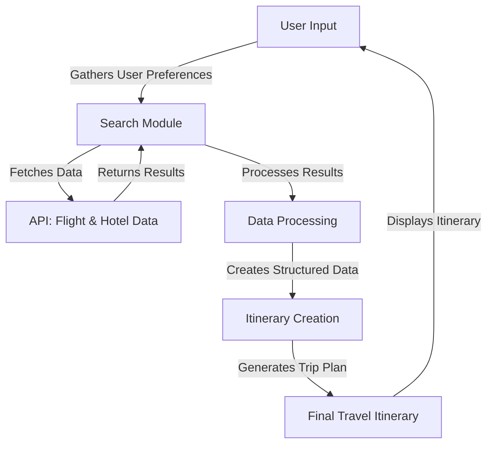

```markdown
# AI-Powered 'Solid Plan' Travel Architect

## Table of Contents
- [Getting Started](#getting-started)
- [Architecture](#architecture)
- [Known Issues](#known-issues)

## Getting Started

To get started with the **AI-Powered 'Solid Plan' Travel Architect**, follow these steps:

### Prerequisites
Before you begin, ensure you have the following installed:
- Python 3.x
- Required packages can be installed using the following command:

```bash
pip install -r requirements.txt
```

### Configuration
1. Clone the repository:
   ```bash
   git clone https://github.com/yourusername/solid-plan-travel-architect.git
   cd solid-plan-travel-architect
   ```

2. Set up your environment variables for API keys and other sensitive configurations. It is recommended to use a `.env` file:
   ```
   API_KEY=your_api_key
   ```

### Running the Application
Execute the main script to start the application:
```bash
python main.py
```

Follow the prompts in the console to enter your travel details, including your destination and travel duration.

## Architecture

The architecture of the **AI-Powered 'Solid Plan' Travel Architect** is modular and follows a clear flow of data and interaction among components. The major components are as follows:

- **User Input Module**: Collects user preferences such as destination and travel duration.
- **Search Module**: Interfaces with external APIs to retrieve real flight and hotel information.
- **Data Processing Module**: Handles search results, refining them based on user preferences.
- **Itinerary Creation Module**: Constructs a structured travel itinerary from the processed information.
- **Output Module**: Displays the completed travel itinerary back to the user.

### RAG Framework

1. **Resource**
   - External APIs for flight and hotel data
   - User preferences

2. **Agent**
   - Main application script
   - Classes such as `FinalTravelPlan`
   - Helper modules including `TavilySearchResults`

3. **Goal**
   - Deliver optimized travel itineraries
   - Customize itineraries based on specified user parameters

### Data Flow Diagram
The following diagram illustrates the flow of data and the interaction among the components.



## Known Issues

### API Call Handling
- **Critical Bug**: Absence of retry logic for API calls may result in no output during network issues.
- **Warning**: API endpoints lack validation against a centralized configuration, leading to hard-coded values.
- **Suggested Refactor**: Implement a dedicated API client class to manage calls systematically.

### Error Handling
- **Critical Bug**: Lack of comprehensive handling for API responses that return error payloads.
- **Warning**: Misinterpretation of different HTTP error statuses (e.g., 400 vs. 500) could occur.
- **Suggested Refactor**: Introduce structured exception handling to log API failures and their parameters.

### Data Validation
- **Critical Bug**: Unvalidated user inputs can cause malformed API requests.
- **Warning**: Outdated libraries for input handling may introduce vulnerabilities.
- **Suggested Refactor**: Establish a validation layer utilizing libraries like `pydantic`.

### Security Vulnerabilities
- **Critical Bug**: Hard-coded API keys present significant security risks.
- **Warning**: Lack of confirmed HTTPS usage for API calls is concerning.
- **Suggested Refactor**: Store sensitive information in environment variables and enforce HTTPS.

### PEP8 Violations
- **Warning**: Lines exceeding 79 characters can compromise code readability.
- **Warning**: Import statements need reorganization as per PEP8 guidelines.
- **Suggested Refactor**: Use linters or formatters like `flake8` or `black` for compliance.

By addressing these issues, users can enhance the stability, security, and maintainability of the **AI-Powered 'Solid Plan' Travel Architect**.

For contributions or queries regarding the application, please create an issue on GitHub or contact the project maintainer.
```
